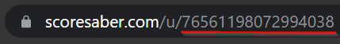

# **Beat Saber Rank Overlay** | A rank overlay for your Beat Saber streams

| Parameter | Usage                   | Comment                       |
| --------- | ----------------------- | ----------------------------- |
| `user-id` | Your Scoresaber User ID |                               |
| `opacity` | Background opacity      | **0** - **1**                 |
| `color`   | Hex color of the stats  | No # in front of the hex code |

Example url:

`http://127.0.0.1:5500/index.html?user-id=76561198072994038&opacity=0.5&color=4c307a`

---

**Q:** Where can I find my User ID?

**A:** You can find it in the url when you visit your profile in Scoresaber

