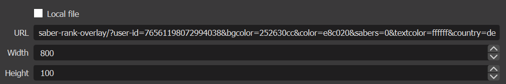
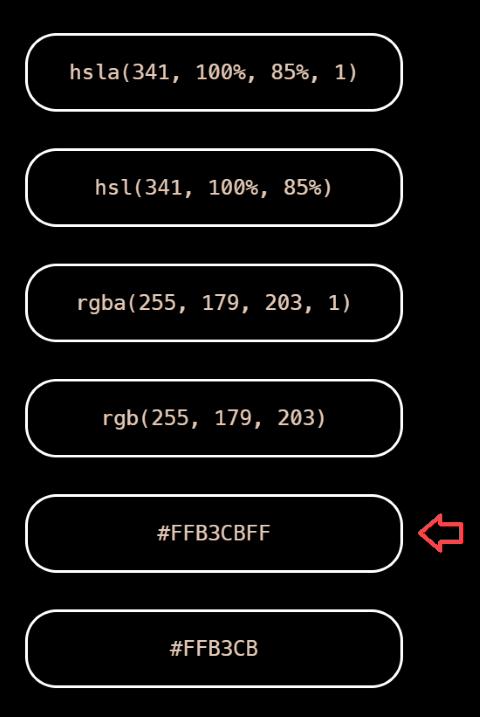

# **Beat Saber Rank Overlay** | A rank overlay for your Beat Saber streams

## URL Parameters

| Parameter   | Description                                         | Example                     | Default  |
| ----------- | --------------------------------------------------- | --------------------------- | -------- |
| `user-id`   | Your Scoresaber User ID                             | `user-id=76561198072994038` | `None`   |
| `color`     | Hex (alpha) color of the stats                      | `color=e8c020`              | `EA7052` |
| `textcolor` | Hex (alpha) color of the text                       | `textcolor=ffffff`          | `FFFFFF` |
| `bgcolor`   | Hex (alpha) color of the background                 | `bgcolor=252630cc`          | `000000` |
| `country`   | Displays your country's flag with your country code | `country=de`                | `None`   |
| `sabers`    | Hide the sabers                                     | `sabers=0`                  | `1`      |

Example URL:

https://maxlikescode.github.io/beat-saber-rank-overlay/?user-id=76561198072994038&bgcolor=252630cc&color=e8c020&sabers=0&textcolor=ffffff&country=de

---

## How to add it to OBS

### 1. Click the **+** button in the sources panel

### 2. Select **Browser**

### 3. Input your URL and play with the size settings

### To refresh your overlay, press "Refresh Cache of current page"

---

# **FAQ**

**Q:** Where can I find my User ID?

**A:** You can find it in the url when you visit your profile in Scoresaber

---

**Q:** Where can I generate a hex alpha color?

**A:** Head to https://fffuel.co/cccolor/, select your color and copy the following hex code:

---

**Q:** Why are my colors not changing?

**A:** Make sure you didn't accidentally add a **#** in front of your hex code in the url parameter or added extra characters

---

**Q:** Where can I find my country code?

**A:** You can find your country code on https://www.iban.com/country-codes

---

**Q:** Why isn't my flag showing up?

**A:** You most likely used the wrong country code

---

**Q:** Why am I redirected to the GitHub 404 Page?

**A:** Make sure you add a **?** before entering your parameters

